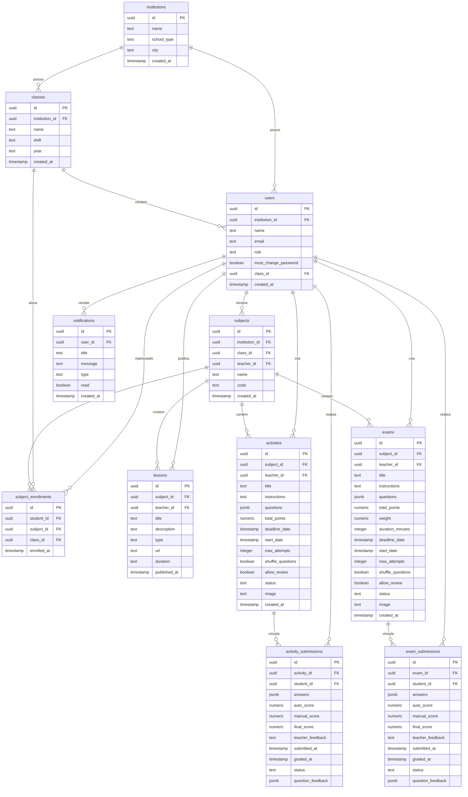

# Documentação do Banco de Dados — Aprende+
## Relatório de Modelagem e Estrutura (Entrega Final)

Este documento descreve a modelagem física, lógica e os relacionamentos do banco de dados da plataforma acadêmica inteligente **Aprende+**. O banco de dados foi desenvolvido utilizando **PostgreSQL** e hospedado no **Supabase**, aproveitando recursos de RLS (Row Level Security), temporizadores nativos e assinaturas em tempo real (Realtime).

O arquivo 'schema_completo_atual.sql' tem uma unificação de todas as abas de consulta (editores de query) que utilizamos no desenvolvimento do banco de dados.
A pasta 'edge functions' inclui as functions de cada ação, sendo algo que utilizamos no projeto real (invés dos Triggers), pois foi o melhor caso para nosso sistema.
O arquivo 'atividadebanco.sql' foi realizado para cumprir as exigências da atividade, não sendo o modelo real utilizado no sistema real.

---

## 1. Diagrama Entidade-Relacionamento (DER)

O diagrama a seguir representa as tabelas do sistema e a cardinalidade de seus relacionamentos:

---

## 2. Dicionário de Dados (Estrutura das Tabelas)

### 2.1. Tabela: `institutions`
Armazena as instituições de ensino cadastradas no sistema.
- `id` (UUID, PK): Identificador único da instituição.
- `name` (TEXT, NOT NULL): Nome da instituição.
- `school_type` (TEXT, NOT NULL): Tipo de instituição. Restrito a: `'faculdade'`, `'escola'`, `'cursinho'`.
- `city` (TEXT): Cidade da instituição.
- `created_at` (TIMESTAMP): Data e hora de criação da instituição.

### 2.2. Tabela: `classes`
Define as turmas pertencentes a uma instituição.
- `id` (UUID, PK): Identificador único da turma.
- `institution_id` (UUID, FK): Referência à instituição dona da turma.
- `name` (TEXT, NOT NULL): Nome da turma (Ex: "3º Ano A").
- `shift` (TEXT): Turno de aula. Restrito a: `'Manhã'`, `'Tarde'`, `'Noite'`, `'Integral'`.
- `year` (TEXT): Ano letivo (Ex: "2026").
- `created_at` (TIMESTAMP): Data de criação.

### 2.3. Tabela: `users`
Espelha o gerenciamento de login e armazena perfis e papéis dos usuários.
- `id` (UUID, PK): ID único (vinculado ao Supabase Auth).
- `institution_id` (UUID, FK): Instituição à qual o usuário pertence.
- `name` (TEXT, NOT NULL): Nome completo.
- `email` (TEXT, NOT NULL, UNIQUE): E-mail único corporativo.
- `role` (TEXT, NOT NULL): Papel no sistema. Restrito a: `'super_admin'`, `'admin'`, `'teacher'`, `'student'`.
- `must_change_password` (BOOLEAN): Flag para exigir alteração de senha no primeiro login.
- `class_id` (UUID, FK): Turma vinculada (usado por alunos).
- `created_at` (TIMESTAMP): Data de cadastro.

### 2.4. Tabela: `subjects`
Armazena as disciplinas oferecidas nas turmas.
- `id` (UUID, PK): ID único da disciplina.
- `institution_id` (UUID, FK): Instituição vinculada.
- `class_id` (UUID, FK): Turma que cursa esta disciplina.
- `teacher_id` (UUID, FK): Professor responsável.
- `name` (TEXT, NOT NULL): Nome da disciplina (Ex: "Banco de Dados II").
- `code` (TEXT, NOT NULL): Código de identificação (Ex: "BD-02").
- `created_at` (TIMESTAMP): Data de criação.

### 2.5. Tabela: `subject_enrollments`
Matrícula específica de alunos em disciplinas (relação N:M entre `users` e `subjects`).
- `id` (UUID, PK): ID único da matrícula.
- `student_id` (UUID, FK): Estudante matriculado.
- `subject_id` (UUID, FK): Disciplina vinculada.
- `class_id` (UUID, FK): Turma associada.
- `enrolled_at` (TIMESTAMP): Data de matrícula.
- *Constraint*: `UNIQUE(student_id, subject_id)` impede matrículas redundantes.

### 2.6. Tabela: `lessons`
Controle de aulas e materiais de apoio criados por professores.
- `id` (UUID, PK): ID único da aula.
- `subject_id` (UUID, FK): Disciplina à qual a aula pertence.
- `teacher_id` (UUID, FK): Professor que publicou a aula.
- `title` (TEXT, NOT NULL): Título da aula.
- `description` (TEXT): Resumo ou notas explicativas.
- `type` (TEXT, NOT NULL): Tipo do material. Restrito a: `'youtube'`, `'pdf'`, `'video'`.
- `url` (TEXT, NOT NULL): Link para o arquivo ou vídeo.
- `duration` (TEXT): Duração da aula/vídeo.
- `published_at` (TIMESTAMP): Data de publicação.

### 2.7. Tabela: `activities`
Atividades avaliativas contendo questões armazenadas de forma estruturada.
- `id` (UUID, PK): ID único da atividade.
- `subject_id` (UUID, FK): Disciplina associada.
- `teacher_id` (UUID, FK): Professor criador.
- `title` (TEXT, NOT NULL): Título da atividade.
- `instructions` (TEXT): Orientações para os alunos.
- `questions` (JSONB, NOT NULL): Lista de questões com alternativas.
- `total_points` (NUMERIC): Valor total da atividade.
- `deadline_date` (TIMESTAMP): Data limite para envio.
- `status` (TEXT): Estado da atividade. Restrito a: `'draft'`, `'published'`.

### 2.8. Tabela: `exams`
Provas avaliativas com controle de tempo de duração.
- `id` (UUID, PK): ID único da prova.
- `subject_id` (UUID, FK): Disciplina associada.
- `teacher_id` (UUID, FK): Professor criador.
- `title` (TEXT, NOT NULL): Título da prova.
- `duration_minutes` (INTEGER, NOT NULL): Duração da prova em minutos.
- `weight` (NUMERIC): Peso da nota na média final.
- `status` (TEXT): Estado. Restrito a: `'draft'`, `'published'`.

### 2.9. Tabela: `activity_submissions` e `exam_submissions`
Respostas enviadas pelos estudantes e suas respectivas correções.
- `id` (UUID, PK): ID único da submissão.
- `activity_id` / `exam_id` (UUID, FK): Atividade ou prova enviada.
- `student_id` (UUID, FK): Aluno que enviou.
- `answers` (JSONB, NOT NULL): Respostas enviadas pelo aluno.
- `auto_score` (NUMERIC): Pontuação computada automaticamente.
- `manual_score` (NUMERIC): Pontuação atribuída manualmente pelo professor.
- `final_score` (NUMERIC): Nota final.
- `teacher_feedback` (TEXT): Feedback escrito do docente.
- `status` (TEXT): Estado da entrega. Restrito a: `'submitted'`, `'late'`, `'graded'`.
- `question_feedback` (JSONB): Feedback pontual para questões específicas.

## 3. Notas Técnicas e Justificativas de Arquitetura

Como o **Aprende+** foi concebido como um produto de software funcional e escalável, a modelagem física e as políticas de segurança foram projetadas focando nas melhores práticas de engenharia de software atuais. A seguir, detalhamos algumas das escolhas arquiteturais que justificam o design do banco de dados, alinhadas à integração com a aplicação:

### 3.1. Lógica de Aplicação Desacoplada do Banco de Dados

Na engenharia de software contemporânea, em particular na arquitetura Serverless (como a pilha React + Supabase), optou-se por centralizar as regras de negócio complexas, fluxos de validação e envio de dados na camada de aplicação (código TypeScript e **Supabase Edge Functions**) em vez de distribuí-las internamente no banco de dados via Procedures e Triggers clássicos (PL/pgSQL).
- **Facilidade de Manutenção**: Manter a lógica no código da aplicação permite o rastreamento integral de alterações via controle de versão (Git) e viabiliza a implementação de testes unitários e de integração automatizados.
- **Segurança de Cadastro**: A utilização de Edge Functions (como as que gerenciam a criação e deleção de professores e alunos) contorna limitações de segurança e manipulação de sessões do navegador, operando no backend sob privilégios específicos (`Service Role`), mantendo o banco de dados livre de gargalos e isolado de processamento de regras de infraestrutura complexas.

- Em resumo: A escolha de Edge Functions em vez de Triggers foi motivada por boas práticas de arquitetura. O uso de Triggers para lógicas complexas pode causar gargalos de processamento (overhead) e travar transações no banco de dados. Com as Edge Functions, a lógica de negócio foi movida para a camada de computação em nuvem (serverless), garantindo maior escalabilidade e mantendo o banco de dados focado estritamente na persistência dos dados.

### 3.2. Abstração de Junções Dinâmicas (Supabase API Client vs. Views)
O cliente de API do Supabase (`@supabase/supabase-js`) atua como uma camada flexível de relacionamento. Consultas de junções de dados (como cruzar alunos, disciplinas, turmas e submissões) são construídas de forma dinâmica no frontend sob demanda (usando seleções aninhadas e filtros nativos da API). 
Isso elimina a necessidade de registrar e gerenciar dezenas de *Views* estáticas dentro do banco de dados para cada listagem do sistema, facilitando a manutenção e prevenindo falhas de compilação ou bloqueios de alteração de tabelas base.

### 3.3. Uso de Dados Semi-Estruturados (Colunas JSONB)
As tabelas de `activities` (atividades), `exams` (provas) e suas submissões utilizam colunas do tipo **JSONB** para gerenciar a lista de questões, alternativas e respostas.
- **Evitando tabelas associativas complexas**: A flexibilidade do formato JSONB elimina a necessidade de criar tabelas pivot redundantes para modelar tipos variados de questões (ex: múltipla escolha, verdadeiro ou falso, dissertativas), mantendo o banco limpo e de fácil leitura.
- **Performance**: A leitura de uma prova e suas respectivas questões ocorre em uma única requisição ao banco de dados, reduzindo sensivelmente o processamento de junções complexas em tempo de execução.

### 3.4. Princípio de Simplificação Arquitetural (YAGNI)
Alinhado ao princípio *YAGNI (You Aren't Gonna Need It)*, evitamos a inserção artificial de índices complexos desnecessários, triggers redundantes e procedimentos fictícios no script de implantação real do software. Isso garante que a base de dados permaneça o mais limpa, performática e manutenível possível para as futuras iterações do projeto acadêmico.

